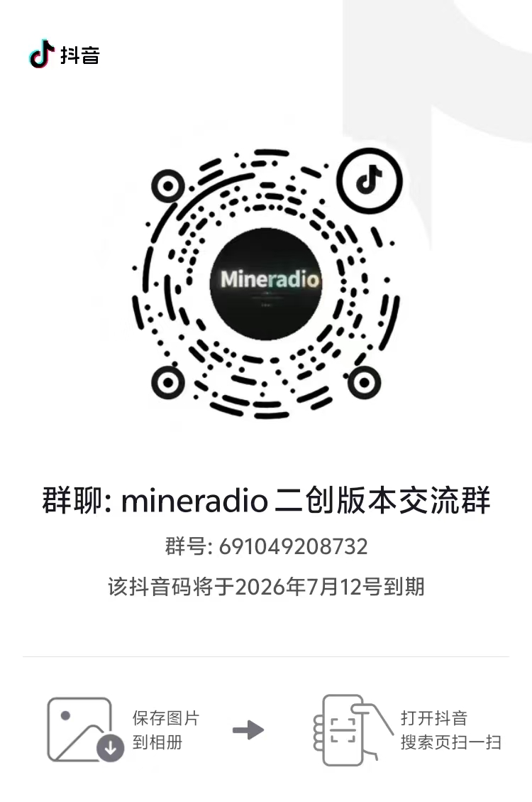

# Mineradio 扩展版


> 非官方二创版本，基于 [XxHuberrr/Mineradio](https://github.com/XxHuberrr/Mineradio)。
> 本仓库用于在尊重原作者和 GPL-3.0 授权的前提下，维护更多音源、歌单导入和个性化体验扩展。

Mineradio 扩展版是一款 Windows 桌面沉浸式音乐播放器。原版 Mineradio 已经提供天气电台、搜索播放、歌词舞台、粒子视觉和 3D 歌单架；本扩展版在此基础上补充酷狗概念版、普通酷狗音乐、汽水音乐歌单导入、个性化 Home 面板和更自由的 DIY 视觉工坊。

## 和原版的关系

- 原项目：[`XxHuberrr/Mineradio`](https://github.com/XxHuberrr/Mineradio)
- 本仓库不是 Mineradio 官方版本，也不代表原作者发布。
- 原作者与原项目贡献必须保留署名。
- 酷狗概念版接入已向原项目提交反馈：[`XxHuberrr/Mineradio#204`](https://github.com/XxHuberrr/Mineradio/pull/204)
- 本仓库是 Austin 后续维护二创扩展功能的主要仓库。

## 下载

普通用户请进入最新版 Release，只下载安装包：

[下载 Mineradio 扩展版最新版](https://github.com/daaimengermengzhu/Mineradio-Extended/releases/latest)

请下载文件名类似下面的安装包：

```text
Mineradio-1.1.1-Setup.exe
```

不要下载这些文件：

- `Source code`：这是源码压缩包，不是普通用户安装包。
- `.blockmap`：这是自动更新用的差异文件，不是安装包。
- `latest.yml`：这是更新配置文件，不是安装包。
- `win-unpacked`：这是打包目录，不建议当作正式安装包分发。

安装包会创建桌面快捷方式。直接运行打包目录里的 `Mineradio.exe` 时，应用也会在首次启动时尝试补创建桌面快捷方式。

## 当前公开扩展

| 模块 | 当前状态 |
| --- | --- |
| 酷狗概念版 | 支持扫码登录、搜索、播放、个人歌单、歌单详情、红心、新建歌单、收藏到歌单、歌词和评论。 |
| 普通酷狗音乐 | 支持扫码登录、搜索、播放、个人歌单、歌单详情、红心、新建歌单、收藏到歌单、歌词和评论。 |
| 酷狗音质 | 酷狗概念版和普通酷狗音乐统一显示 `Hi-Res音质`、`无损音质`、`高品音质`、`标准音质` 四档，并按实际返回码率校正展示。 |
| 汽水音乐 | 支持粘贴分享歌单链接并生成本地“汽水音乐歌单”。汽水自身音源不可直接播放时，会尝试换源到其它可用平台。 |
| 第三方音源 | 支持用户自行导入符合落雪 API 2.0.0 的可信 `.js` 音源脚本，作为官方播放地址发生技术故障时的可选回退。当前可映射网易云、QQ、酷狗概念版和普通酷狗。 |
| 我的歌单 | 歌单详情支持按收藏时间、歌手名、本地播放次数等方式查看。 |
| Home 个性化 | 左侧“我的音乐海报”支持换本地图片、使用当前封面、页面内编辑文案和重置。 |
| DIY 视觉 | 新增“我的作品”和“形态工坊”，支持用点、线、环、曲线环、螺旋等基础粒子创建本地自定义形态，导入/导出 `.mineradio-visual.json` 和 `.mineradio-shape.json`。 |
| 安装体验 | 提供 Windows 安装包，安装后可通过桌面快捷方式启动。 |

更完整的普通用户教程见：[使用教程](./docs/USAGE_GUIDE.md)

## 使用说明与限制

- 本扩展版不会绕过付费、绕过会员、破解音质或重新分发音乐内容。
- 第三方平台接入只用于个人学习、本地客户端体验和用户自有账号的播放辅助。
- 汽水音乐目前重点是歌单导入；如果汽水返回的是浏览器不能直接解码的加密音频，播放器会按现有策略尝试换源。
- 酷狗官方音效暂未接入；界面里的“动态/律动”属于视觉效果，不等于酷狗官方音效。
- DIY 形态工坊是公开功能，但不会内置二创作者的个人实验形态；用户可以自己创建、保存、导入和导出形态。

## 第三方音源脚本

桌面应用右上角的插头按钮用于管理第三方音源。可以导入、启用、停用、替换或删除符合落雪自定义音源 API 2.0.0 的 `.js` 脚本，同一时间只能启用一个。

- 播放器始终先请求歌曲所属平台的官方播放地址。
- 只有网络、地址失效或格式兼容等技术问题才会尝试已启用脚本。
- 登录、会员、购买和版权限制不会触发第三方解析。
- 脚本在隔离运行环境中执行，不能读取平台登录 Cookie、本地文件和 Node.js；网络请求会拦截本机、局域网及保留地址。
- 本仓库不内置、不推荐，也不自动下载任何第三方音源脚本。脚本可能把歌曲名称、歌手和歌曲 ID 等解析所需信息发送到外部服务，只应导入来源可信、内容可审查的脚本。
- 落雪标准平台键当前覆盖网易云、QQ 和酷狗；汽水音乐没有对应标准键，因此暂不支持通过此兼容层解析。

## 交流群

欢迎对 Mineradio 扩展版感兴趣的朋友加群交流使用体验、问题反馈和二创想法。

二维码会定期过期，如果图片失效，请以仓库后续更新为准。

| 微信群聊 | 抖音群聊 |
| --- | --- |
|  |  |

## 下载或安装被拦截怎么办

小众 Electron 桌面软件、未签名安装包有时会被浏览器、Windows Defender 或 SmartScreen 提示风险。请先确认安装包来自本仓库 GitHub Release。

1. 浏览器下载栏提示风险时，打开下载列表，点这条下载右侧的 `...`，选择 `保留` / `仍要保留` / `显示更多` 后继续保留。
2. Windows SmartScreen 弹出蓝色拦截窗口时，点 `更多信息`，再点 `仍要运行`。
3. 如果杀毒软件明确显示木马、高危或已经隔离，不要强行运行；请删除该文件后重新从 GitHub Release 下载，仍然异常请带截图反馈。

## 支持渠道

本仓库是非官方二创版本。原作者支持渠道和二创作者支持渠道分开展示，扫码前请确认收款人信息。

[查看完整支持页](./docs/SUPPORT.md)

### 原作者支持渠道

如果原版 Mineradio 陪你多听了一首歌，也欢迎通过原作者支持渠道支持原作者。


### 二创作者支持渠道

如果扩展版的酷狗概念版、普通酷狗、汽水歌单导入或个性化功能帮到了你，也可以通过二创作者支持渠道支持后续维护。


## 开发者说明

```bash
npm install
npm start
npm run test:custom-source
npm run test:custom-source:electron
npm run build:win
```

普通用户不需要运行这些命令，直接下载安装包即可。开发者如需本地调试或重新打包，可以使用上面的命令。

## 致谢

Mineradio 由 XxHuberrr 主要设计与打造。emily 作为早期视觉底层想法与 `emily` 视觉预设改进方向的共创者和灵感来源之一，特此感谢。

## 版权与授权

Copyright (C) 2026 XxHuberrr.

本项目采用 GPL-3.0 授权。详见 [LICENSE](./LICENSE)。

MR Logo、Mineradio 名称、界面视觉设计与原创视觉表达归作者所有；第三方依赖和第三方服务分别遵循其各自授权与服务条款。
